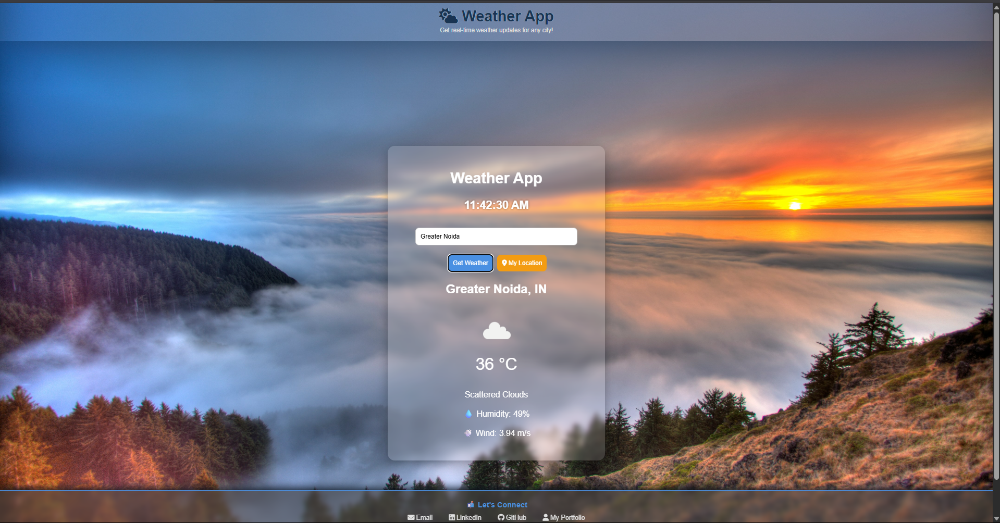

# 🌦️ Weather App

A clean and responsive weather app built using **HTML**, **CSS**, and **JavaScript** that fetches real-time weather data using the **OpenWeatherMap API**. The app also includes a beautiful full-screen background image and dynamically changes the container’s appearance based on the weather conditions.

---

## 🌐 Live Demo

[Click here to view the app](https://shawez-04.github.io/Weather-App/)

---

## 📸 Preview



---

## 🚀 Features

- 🔍 Search for current weather by city name
- 📡 Real-time data using OpenWeatherMap API
- 📍 Get weather based on current location using Geolocation API
- 🎨 Dynamic container background based on weather (e.g., Clear, Rain, Clouds)
- 📱 Fully responsive design
- ⏰ Live real-time digital clock
- 🖼️ Full-screen background image without cropping
- 🔗 Footer with external links (LinkedIn, GitHub, Portfolio)

---

## 🛠️ Technologies Used

- **HTML5**
- **CSS3**
- **JavaScript (Vanilla JS)**
- **OpenWeatherMap API**

---

## 🧑‍💻 How to Use Locally

1. **Clone the repository**
   ```bash
   git clone https://github.com/shawez-04/Weather-App.git
   cd Weather-App

2.  Open the project
    open index.html in your browser.

3. (Optional) Add your own API key

   Go to https://openweathermap.org/api and generate an API key.
   In script.js, replace the value of apiKey with your own:

   const apiKey = "your_api_key_here";
   
---------------------------------------------------------------------------------------------------------------------------------------------------------------------------------

📄 License
This project is open source.
Feel free to use and modify for learning or personal projects ✨

✨ Author
Made with ❤️ by Mohd Shawez Khan  
